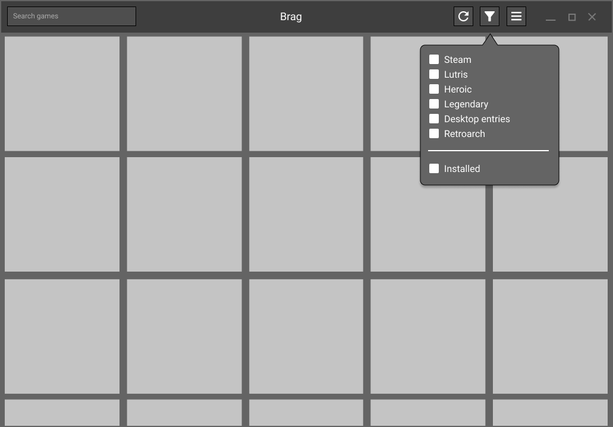
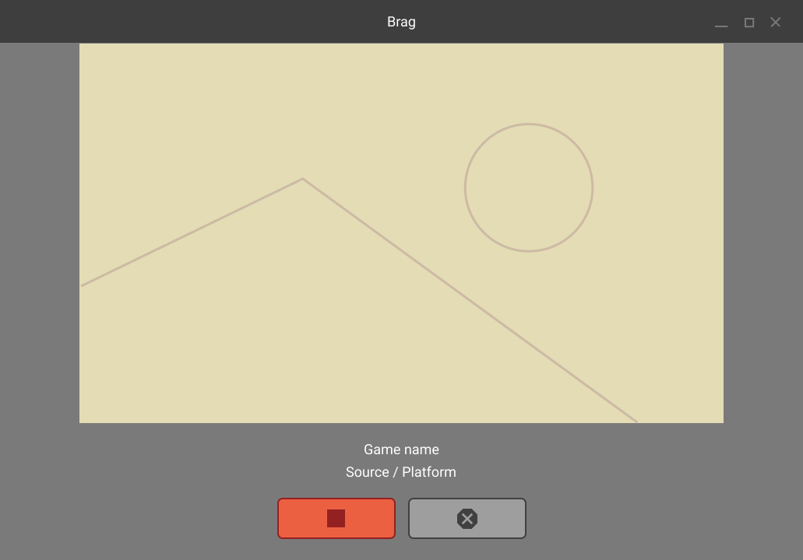

# Gali's UI

## July of 2022, Migration

As you can see, the project has migrated to Python instead of Node or GJS.  
I realized that basing a GUI program on an underused slate is not the best idea...

Python is opten used for Gtk apps, and the PyGobject bindings are well-liked by the community.
Rust users will be mad, but I'm not ready to move to it yet.

In the following month, another contributor will join me on this project on the UI side.
Expect new UI mockups 😄 !

## May of 2022, New ideas

During the long hiatus, I've taken time to work on other projects and reflect on Gali's architecture. I am not satisfied with any of the UI solutions used at the moment. Node-gtk is not mature enough, electron is bloated and all of these are basically using a screwdriver to plant a nail. 

I've made the mistake of treating Gali as a monolith, but it really needs to be split. My idea as of now is :  

- "Server", starts the UI, initiates scans, communicates with subprocesses.
- "Database", storing the scanned games data
- "UI", responsible for, well, the UI
- "Scanner", responsible for scanning for games

The UI just can't store all the data at once, **pagination is mandatory**.
Also, the OOP based architecture is flawed in this case. All of the scanned games need to be serializable.  
Practically, games need to be composed of **only data**, not methods.

Ultimately, I really want to use GTK, so the project will likely migrate to GJS. 

## Second mockups
This time I used Figma. The design file is [publicly available here](https://www.figma.com/file/YcTUGVEvarxrgpq01VkieN/Gali-Second-mockups?node-id=0%3A1).  
These mockups are higher fidelity, but not final yet. My goal with this revision 
is to start defining a system of app states.

    
show images

    <table>
        <tr>
            <th>Browsing view</th>
            <th>Scanning view</th>
        </tr>
        <tr>
            <td></td>
            <td></td>
        </tr>
        <tr>
            <th>Selection view</th>
            <th>Life cycle view</th>
        </tr>
        <tr>
            <td></td>
            <td></td>
        </tr>
    </table>

## First mockups
These images were made to give a rough idea of what the UI should look like.  
I used [Pencil](https://pencil.evolus.vn/) to make these mockups, although I 
don't recommend using it since the project seems to be inactive for quite some 
months.  
I took inspiration from [Lutris](https://github.com/lutris/lutris).  

    
show images

    <table>
        <tr>
            <th>Games grid, default view</th>
            <th>Scanning view, replacing the default view</th>
        </tr>
        <tr>
            <td></td>
            <td></td>
        </tr>
        <tr>
            <th>Game info popover with a start button</th>
            <th>Game info with a stop and kill button</th>
        </tr>
        <tr>
            <td></td>
            <td></td>
        </tr>
    </table>

