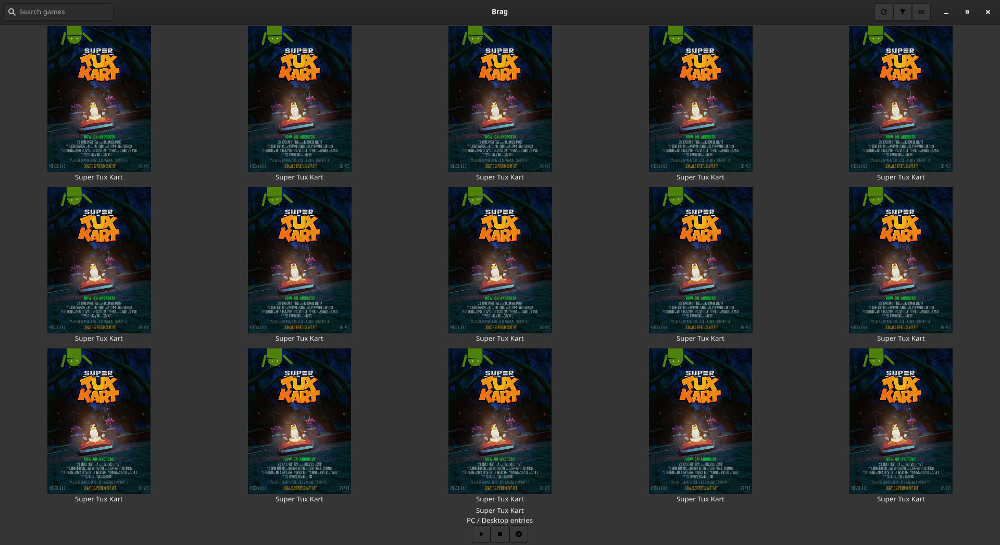
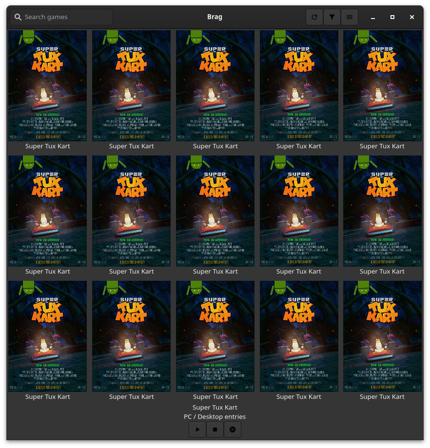

# Brag's UI
## Mockups
These images were made to give a rough idea of what the UI should look like.  
I used [Pencil](https://pencil.evolus.vn/) to make these mockups, although I don't recommend using it since the project seems to be inactive for quite some months.  
I took inspiration from [Lutris](https://github.com/lutris/lutris).  

|   |   |
| - | - |
| Games grid, default view | Scanning view, replacing the default view |
|  |  |
| Game info popover with a start button | Game info with a stop and kill button |
|  |  |

## Current state
I'm battling grid picture sizing. I'm trying to split the grid's available size between the grid elements equally to fill it (OK) and make the pictures take their element's full width (not OK yet) and overflow vertically if needed (not OK yet). 

| Current (wrong) grid spacing | Expected spacing (overflowing verttically) |
| - | - |
|  |  |

## TODO
* ✅ ~~Use XML to describe the UI~~ (XML in JS, it's a compromise with `node-gtk`, see [issue 316](https://github.com/romgrk/node-gtk/issues/316))
* 🔶 Grid with a fixed number of columns  
	The images should always take up ~1/5 the width if there's 5 elements per row.  
	I tried setting `can-shrink` to `false` but this just makes the `Picture`s their natural width.  
	Find a way to make the `FlowBoxChild`s share equally the total width then make the `Picture`s fill their immediate parent.  
	**Update** : I asked [on Gnome's discourse forum](https://discourse.gnome.org/t/how-to-make-an-image-fill-the-width-of-a-box-and-keep-aspect-ratio/7980/4) and **no-fucking-body** knows how to do this.  
	I'm considering a fixed image width à-la Lutris. It's been 6 days of me banging my head on this, I'll let it sit for now. 
* Create the view change for scanning
* Make app startup trigger a library scan
* Make scan button trigger a library scan
* Bind grid element selection to the revealer (visible state + content)
* Bind libary content to the game grid
* Bind the grid resize to its option
* Create the popup menus
	* Source filtering (+ installed filtering)
	* Settings
* HeaderBar buttons toggle the corresponding menus
* Bind the game life cycle buttons to their game methods
* Bind source filtering to the game grid