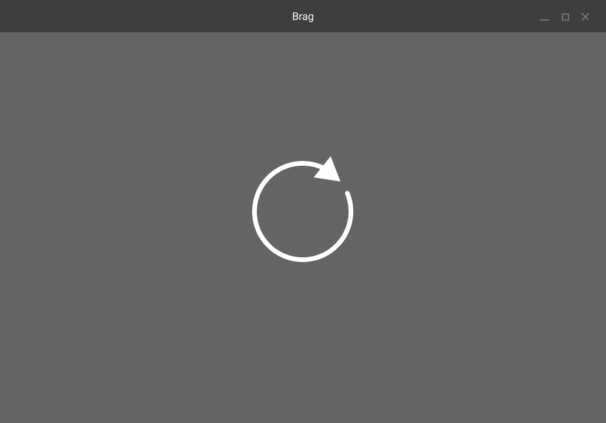
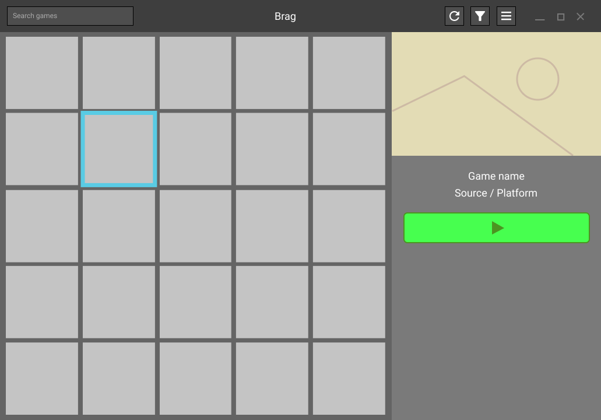

# Gali's UI

## First mockups
These images were made to give a rough idea of what the UI should look like.  
I used [Pencil](https://pencil.evolus.vn/) to make these mockups, although I 
don't recommend using it since the project seems to be inactive for quite some 
months.  
I took inspiration from [Lutris](https://github.com/lutris/lutris).  

    
show images

    <table>
        <tr>
            <th>Games grid, default view</th>
            <th>Scanning view, replacing the default view</th>
        </tr>
        <tr>
            <td></td>
            <td></td>
        </tr>
        <tr>
            <th>Game info popover with a start button</th>
            <th>Game info with a stop and kill button</th>
        </tr>
        <tr>
            <td></td>
            <td></td>
        </tr>
    </table>

## Second mockups
This time I used Figma. The design file is [publicly available here](https://www.figma.com/file/YcTUGVEvarxrgpq01VkieN/Gali-Second-mockups?node-id=0%3A1).  
These mockups are higher fidelity, but not final yet. My goal with this revision 
is to start defining a system of app states.

    
show images

    <table>
        <tr>
            <th>Browsing view</th>
            <th>Scanning view</th>
        </tr>
        <tr>
            <td></td>
            <td></td>
        </tr>
        <tr>
            <th>Selection view</th>
            <th>Life cycle view</th>
        </tr>
        <tr>
            <td></td>
            <td></td>
        </tr>
    </table>

## Help and workarounds

### The game grid 
After quite some time, I've figured out how to make the cover images expand to 
fill the grid's width. This was thanks to **Marco Melorio** 
[on Gnome's discourse forum](https://discourse.gnome.org/t/how-to-make-an-image-fill-the-width-of-a-box-and-keep-aspect-ratio/7980/6?u=geoffreycoulaud).
I'll pass the details but it almost made me ditch the fixed number of columns 
design choice.

### The event loop
At the moment, `node-gtk` doesn't have a way to make GLib's event loop and 
Node's run simultaneously. This broke my UI code in some places.  
On the dedicated discord server, `NathanaelA#3774` found a solution and gave an 
example that uses a separate UI process and inter process messaging.

This was our discussion

NathanaelA:
<blockquote>
`Promises` appear to work fine for me in the GTK3 code as my Webkit browser 
code uses promises and async code and everything works, not sure on GTK4.   
However, one easy way around this issue is to use node-gtk only for the UI.
I had to pivot to this design because I actually needed both a GTK 3 and GTK 4
window open at the same time and that is impossible to do in a single process
(even Python and GJS will error out ).    
Unfortunately I need to access a WebKit occasionally and on my version of
Linux it forces GTK3 to be loaded when it is loaded).   
GTK 4 I used for everything else as it has a much nicer api.   
So my app I now have it built like this:
Node (Primary Process and virtually all logic, NO visual UI from this one, it 
is unaware of GTK)  
 -> (optional) Forked Node (GTK 4) primary app window  
 -> (optional) Forked Node (GTK 3) WebKit window 

It does use a few more megs of memory when I start any of the GTK forks, but 
the primary node instance has no issues with the setTimeout or Promises or 
anything dealing with the message loops as GTK is not running in it.  
And the forked nodes can be open as many times as needed and can be fairly 
dumb as they can directly just send any and all events back to the primary 
node process.

In addition you get real multitasking in some areas as the primary node 
process isn't held up by anything either of the GTK processes are doing. 😉
</blockquote>

Me:
<blockquote>
This is promising (pun intended), I will have to check this more in detail and 
maybe look at some code if you don't mind sharing ?  
I'll gladly pass the "rewrite your app to use another runtime" thing
</blockquote>

NathanaelA:
<blockquote>
I haven't released anything of what I'm doing yet.   
Here is the base part that should help you get started:

<pre><code>"use strict";

let child_app = null;
let child_browser = null;

import { fork } from "node:child_process"

console.log("Application Starting");
start_mainView()
start_webView();

function start_webView() {
    child_browser = fork("webview.mjs", [], {
        cwd: "./webview/"        
    });
    child_browser.on("message", (m) => {
        console.log("Child sent message", m);
        handleWebViewMessage(m);
    })
    child_browser.on("close", () => {
        console.log("Child  Quit");
        child_browser = null;
    })    
}

function start_mainView() {
    child_app = fork("mainview.mjs", [], {
        cwd: "./application/",
    });
    child_app.on("message", (m) => {
        console.log("Child sent message", m);
        handle_mainViewMessage(m);
    });
    child_app.on("close", () => {
        console.log("Child Quit"); 
        child_app = null;       
    });
}
</code></pre>

And basically a child is like this (this is the start of my webview app):

<pre><code>"use strict";

import {Application, GTKConfig} from "node-gtk-ui";
const WebKit = GTKConfig.Webkit; // Force loading of WebKit which will force GTK3 (or GTK4 later versions)

// Are we a child?
if (process.channel) {
    process.on("message", (m) => {
        switch (m.type) {
            case 'quit': process.exit(0); break;
            case 'status': process.send({status: 1}); break;
            case '...': // Other messages we want to handle
        }
    });
}
const app = new Application( {width: 800, height: 800, title: "Login"});

let stackLayout = app.document.createElement("div");
app.document.appendChild(stackLayout);
let webview = app.document.createElement("webview");
stackLayout.appendChild(webview);
webview.src = "https://nativescript.tools/";
</code></pre>

</blockquote>

However, this move to a multi-process app doesn't make as much sense to my use
case, because lots of data would have to be shared between them (the library).  

The solution to my problem was to wrap `app.run()` in a microtask (like 
`setTimeout`).
Commit #31a07ca has this main/view process separation but moving 
forward it's going to be removed since it complexifies the app's architecture
and adds no benefit *for this use case*.

## May of 2022, New ideas

During the long hiatus, I've taken time to work on other projects and reflect on Gali's architecture. I am not satisfied with any of the UI solutions used at the moment. Node-gtk is not mature enough, electron is bloated and all of these are basically using a screwdriver to plant a nail. 

I've made the mistake of treating Gali as a monolith, but it really needs to be split. My idea as of now is :  

- "Server", starts the UI, initiates scans, communicates with subprocesses.
- "Database", storing the scanned games data
- "UI", responsible for, well, the UI
- "Scanner", responsible for scanning for games

The UI just can't store all the data at once, **pagination is mandatory**.
Also, the OOP based architecture is flawed in this case. All of the scanned games need to be serializable.  
Practically, games need to be composed of **only data**, not methods.

Ultimately, I really want to use GTK, so the project will likely migrate to GJS. 