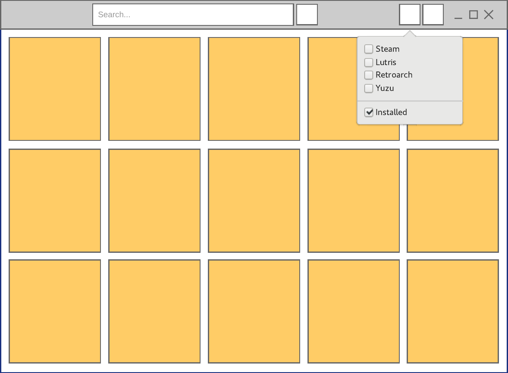
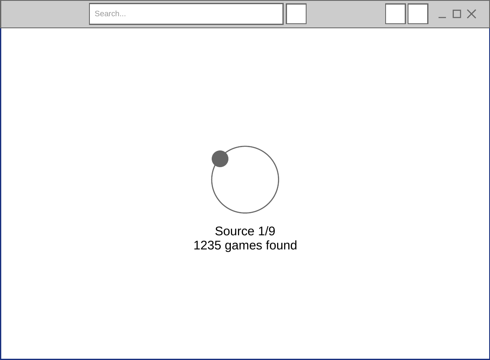
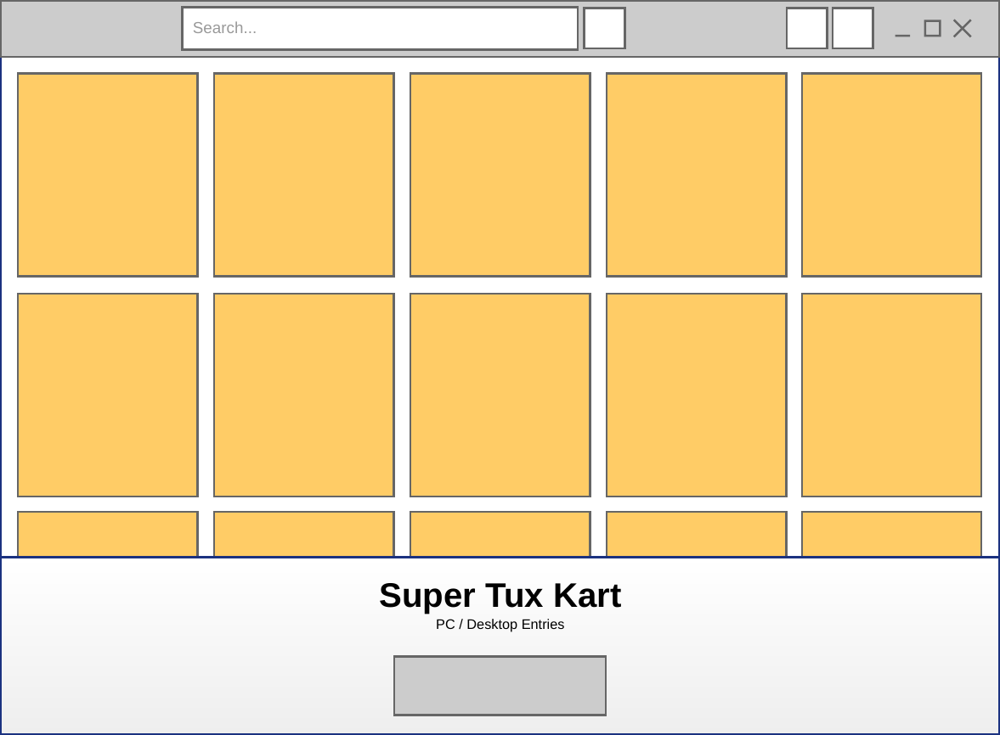

# Brag's UI
## Mockups
These images were made to give a rough idea of what the UI should look like.  
I used [Pencil](https://pencil.evolus.vn/) to make these mockups, although I don't recommend using it since the project seems to be inactive for quite some months.  
I took inspiration from [Lutris](https://github.com/lutris/lutris).  

|   |   |
| - | - |
| Games grid, default view | Scanning view, replacing the default view |
|  |  |
| Game info popover with a start button | Game info with a stop and kill button |
|  |  |

## TODO
* ✅ ~~Use XML to describe the UI~~
* 🔶 Grid with a fixed number of columns  
	The images should always take up ~1/5 the width if there's 5 elements per row.  
	I tried setting `can-shrink` to `false` but this just makes the `Picture`s their natural width.  
	Find a way to make the `FlowBoxChild`s share equally the total width then make the `Picture`s fill their immediate parent.  
	**Update** : I asked [on Gnome's discourse forum](https://discourse.gnome.org/t/how-to-make-an-image-fill-the-width-of-a-box-and-keep-aspect-ratio/7980/4) and **no-fucking-body** knows how to do this.  
	I'm considering a fixed image width à-la Lutris. It's been 6 days of me banging my head on this, I'll let it sit for now. 
* Create the view change for scanning
* Make app startup trigger a library scan
* Make scan button trigger a library scan
* Bind grid element selection to the revealer (visible state + content)
* Bind libary content to the game grid
* Bind the grid resize to its option
* Create the popup menus
	* Source filtering (+ installed filtering)
	* Settings
* HeaderBar buttons toggle the corresponding menus
* Bind the game life cycle buttons to their game methods
* Bind source filtering to the game grid

## Help and workarounds

### The event loop
At the moment, `node-gtk` doesn't have a way to make GLib's event loop and Node's
run simultaneously. This broke my UI code in some places.  
On the dedicated discord server, `NathanaelA#3774` found a solution and gave an 
example that uses a separate UI process and inter process messaging.

NathanaelA:
> `Promises` appear to work fine for me in the GTK3 code as my Webkit browser 
> code uses promises and async code and everything works, not sure on GTK4.   
> However, one easy way around this issue is to use node-gtk only for the UI.
> I had to pivot to this design because I actually needed both a GTK 3 and GTK 4
> window open at the same time and that is impossible to do in a single process
> (even Python and GJS will error out ).    
> Unfortunately I need to access a WebKit occasionally and on my version of
> Linux it forces GTK3 to be loaded when it is loaded).   
> GTK 4 I used for everything else as it has a much nicer api.   
> So my app I now have it built like this:
>
> Node (Primary Process and virtually all logic, NO visual UI from this one, it 
> is unaware of GTK)  
> -> (optional) Forked Node (GTK 4) primary app window  
> -> (optional) Forked Node (GTK 3) WebKit window 
>
> It does use a few more megs of memory when I start any of the GTK forks, but 
> the primary node instance has no issues with the setTimeout or Promises or 
> anything dealing with the message loops as GTK is not running in it.  
> And the forked nodes can be open as many times as needed and can be fairly 
> dumb as they can directly just send any and all events back to the primary 
> node process.
>
> In addition you get real multitasking in some areas as the primary node 
> process isn't held up by anything either of the GTK processes are doing. 😉

Me:
> This is promising (pun intended), I will have to check this more in detail and 
> maybe look at some code if you don't mind sharing ?  
> I'll gladly pass the "rewrite your app to use another runtime" thing

NathanaelA:
> I haven't released anything of what I'm doing yet.   
> Here is the base part that should help you get started:

```js
"use strict";

let child_app = null;
let child_browser = null;

import { fork } from "node:child_process"

console.log("Application Starting");
start_mainView()
start_webView();

function start_webView() {
    child_browser = fork("webview.mjs", [], {
        cwd: "./webview/"        
    });
    child_browser.on("message", (m) => {
        console.log("Child sent message", m);
        handleWebViewMessage(m);
    })
    child_browser.on("close", () => {
        console.log("Child  Quit");
        child_browser = null;
    })    
}

function start_mainView() {
    child_app = fork("mainview.mjs", [], {
        cwd: "./application/",
    });
    child_app.on("message", (m) => {
        console.log("Child sent message", m);
        handle_mainViewMessage(m);
    });
    child_app.on("close", () => {
        console.log("Child Quit"); 
        child_app = null;       
    });
}
```
> And basically a child is like this (this is the start of my webview app):

```js
"use strict";

import {Application, GTKConfig} from "node-gtk-ui";
const WebKit = GTKConfig.Webkit; // Force loading of WebKit which will force GTK3 (or GTK4 later versions)

// Are we a child?
if (process.channel) {
    process.on("message", (m) => {
        switch (m.type) {
            case 'quit': process.exit(0); break;
            case 'status': process.send({status: 1}); break;
            case '...': // Other messages we want to handle
        }
    });
}
const app = new Application( {width: 800, height: 800, title: "Login"});

let stackLayout = app.document.createElement("div");
app.document.appendChild(stackLayout);
let webview = app.document.createElement("webview");
stackLayout.appendChild(webview);
webview.src = "https://nativescript.tools/";
```